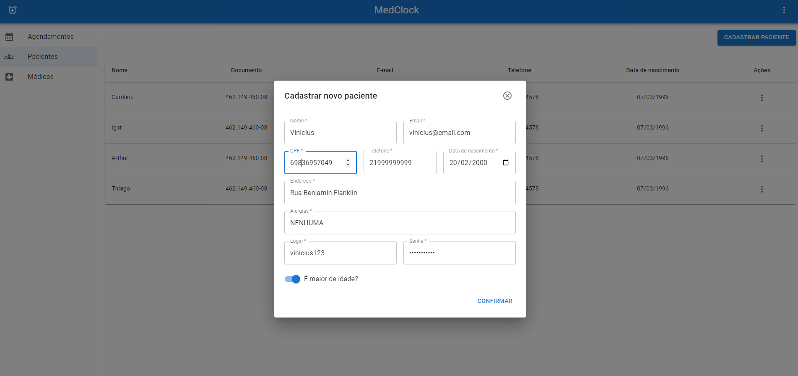
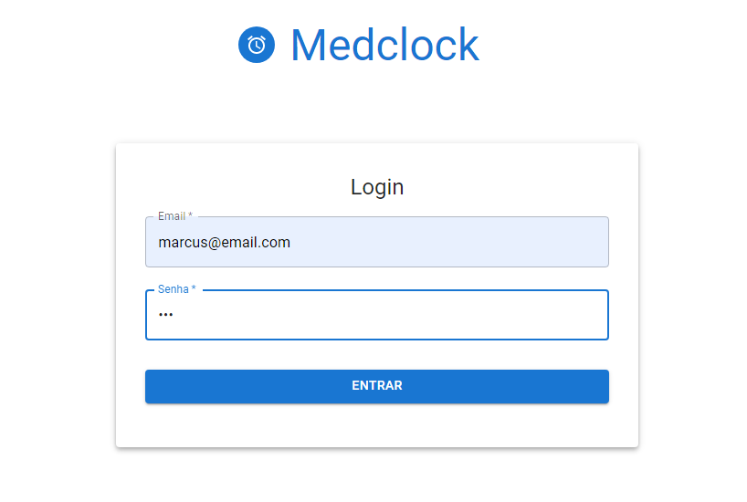
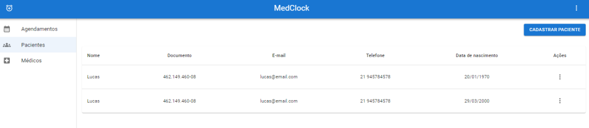
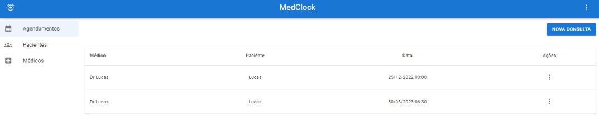
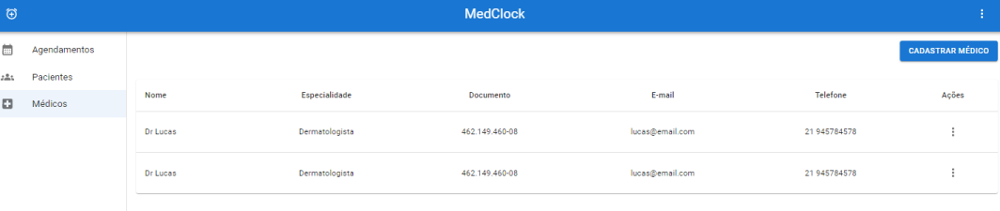
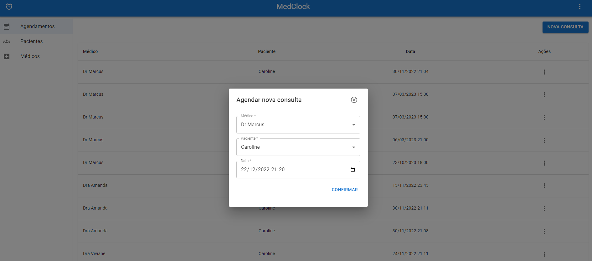
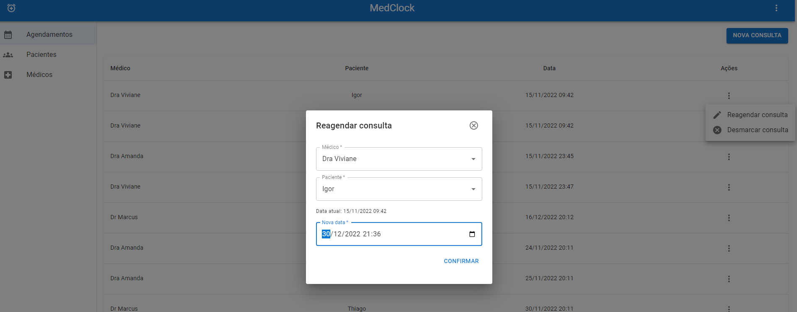
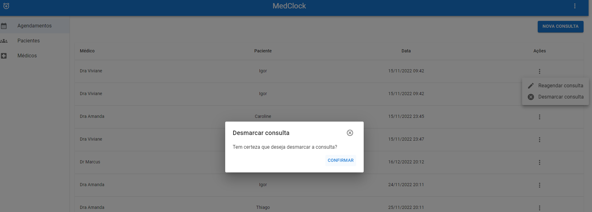
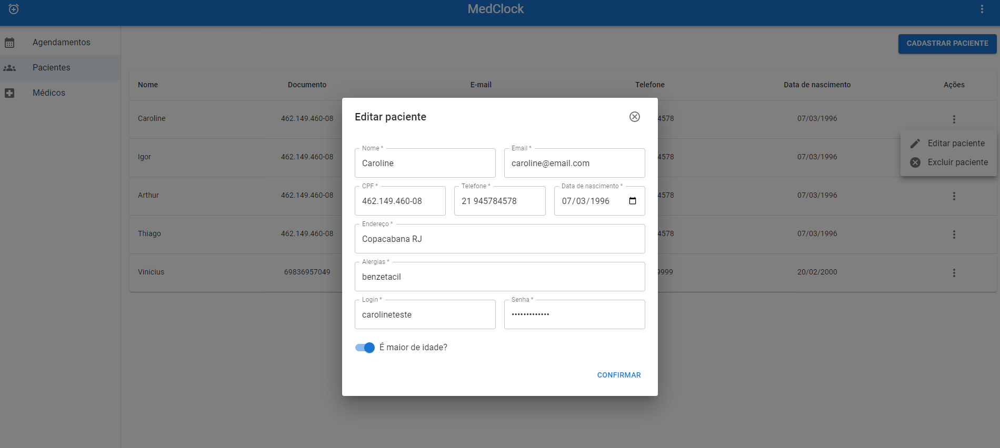
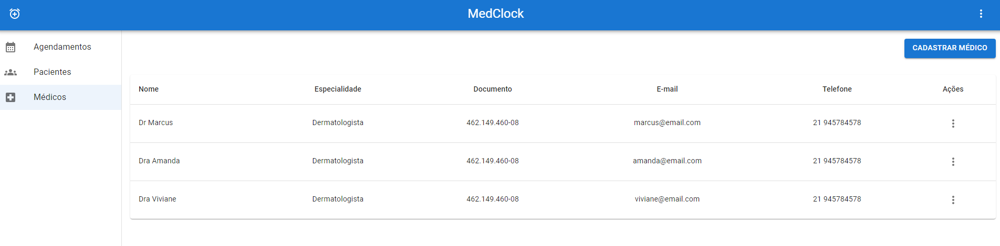

# Registro de Testes de Usabilidade

## *Os resultados dos testes de usabilidade estão descritos nas tabelas abaixo:*

| Caso de teste 01    | CT 01 - Cadastro (paciente)
|-------|-----------------------------------------------------------------------------------------------------------------|
| Objetivo do teste | Verificar a usabilidade da funcionalidade de cadastro na plataforma.                       |
|Resultado|                                                                             |

 

| Caso de teste 02    | CT 02 - Fazer login (paciente)
|-------|-----------------------------------------------------------------------------------------------------------------|
| Objetivo do teste | Verificar a usabilidade da funcionalidade de fazer login.                                  |
|Resultado|                                                                            |

 

| Caso de teste 03    | CT 03 - Vizualizar agenda (paciente)
|-------|-----------------------------------------------------------------------------------------------------------------|
| Objetivo do teste | Verificar a usabilidade da funcionalidade de vizualizar agenda.                            |
|Resultado|                                                                          |

 

| Caso de teste 04    | CT 04 - Vizualizar listagem (agendamento)
|-------|-----------------------------------------------------------------------------------------------------------------|
| Objetivo do teste | Verificar a usabilidade da funcionalidade de vizualizar agenda.                            |
|Resultado|                                                                             |

 

| Caso de teste 05    | CT 04 - Vizualizar listagem (medico)
|-------|-----------------------------------------------------------------------------------------------------------------|
| Objetivo do teste | Verificar a usabilidade da funcionalidade de vizualizar agenda.                            |
|Resultado|                                                                             |

 

| Caso de teste 06    | CT 04 - Vizualizar listagem (paciente)
|-------|-----------------------------------------------------------------------------------------------------------------|
| Objetivo do teste | Verificar a usabilidade da funcionalidade de vizualizar agenda.                            |
|Resultado|                                                                             |

 

| Caso de teste 07    | CT 04 - Marcar consultas (paciente)
|-------|-----------------------------------------------------------------------------------------------------------------|
| Objetivo do teste | Verificar a usabilidade da funcionalidade de marcar consultas.                             |
|Resultado|                                                                           |

 

| Caso de teste 08    | CT 05 - Remarcar consulta (paciente)
|-------|-----------------------------------------------------------------------------------------------------------------|
| Objetivo do teste | Verificar a usabilidade da funcionalidade de remarcar consulta.                            |
|Resultado|                                                                           |

 

| Caso de teste 09    | CT 06 - Desmarcar consulta (paciente)
|-------|-----------------------------------------------------------------------------------------------------------------|
| Objetivo do teste | Verificar a usabilidade da funcionalidade de desmarcar consulta                            |
|Resultado|                                                                             |

 

| Caso de teste 10    | CT 07 - Editar informaçoes (paciente)
|-------|-----------------------------------------------------------------------------------------------------------------|
| Objetivo do teste | Verificar a usabilidade da funcionalidade de editar informaçoes.                           |
|Resultado|                                                                           |

 

| Caso de teste 11    | CT 08 - Agenda medica(Clinica)
|-------|-----------------------------------------------------------------------------------------------------------------|
| Objetivo do teste | Verificar a usabilidade da funcionalidade da agenda medica.                                |
|Resultado|                                                                              |